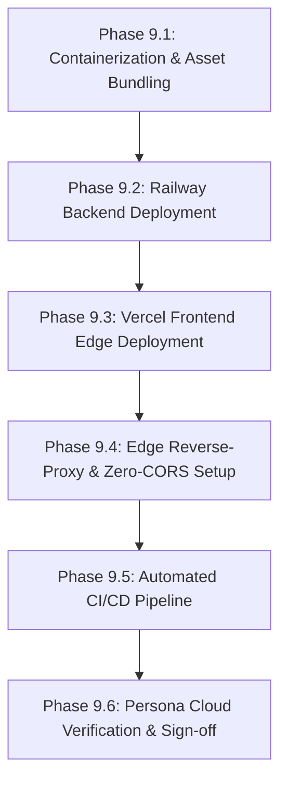

# Production Deployment Plan: AI-Powered Restaurant Recommendation System
*(Grounded in `zomoto-implementation-plan.md` • Backend on Railway • Frontend on Vercel)*

---

## 1. Overview & Objectives

This document defines the production deployment plan for the **AI-Powered Restaurant Recommendation System**, extending the engineering foundations established in [`zomoto-implementation-plan.md`](file:///C:/Users/HP/workspace/AI_AI_AI/ToDo/DemoZomoto/zomoto-implementation-plan.md), [`zomoto-architecture.md`](file:///C:/Users/HP/workspace/AI_AI_AI/ToDo/DemoZomoto/zomoto-architecture.md), and [`zomoto-plan.md`](file:///C:/Users/HP/workspace/AI_AI_AI/ToDo/DemoZomoto/zomoto-plan.md).

### Transition from Local Development to Cloud Production

| Local Development (Phases 1–8) | Cloud Production Architecture (Phase 9) |
| :--- | :--- |
| **Phase 1: Environment & Dependencies** | Pinned dependencies containerized in multi-stage Debian-slim container |
| **Phase 2: Data Ingestion (`zomato_clean.parquet`)** | Bundled `2.46 MB` snappy Parquet pre-loaded in container memory ($<1.5\text{s}$ cold boot) |
| **Phase 3: Domain Models & Settings** | Production Pydantic configuration via Railway cloud environment variables |
| **Phase 4: Stage 1 Retrieval Engine** | High-speed in-memory vector/tabular filtering ($<30\text{ms}$) on Railway compute |
| **Phase 5: Stage 2 AI Reasoning (Groq)** | Secure server-side Groq LPU inference with automatic heuristic fallback |
| **Phase 6: FastAPI Application (`app/main.py`)** | Production ASGI service on **Railway** with dynamic `$PORT`, health probes, and metrics |
| **Phase 7: Frontend Interface** | **DineMind AI** Google Stitch UI (`app/static/index.html`) deployed globally on **Vercel Edge CDN** |
| **Phase 8: Validation & Persona Testing** | Live cloud end-to-end smoke testing across Personas A–D over HTTPS |

---

## 2. Production Directory Structure & File Map

```
DemoZomoto/
│
├── Dockerfile                          # Railway production container build specification
├── .dockerignore                       # Docker build context exclusion rules
├── railway.json                        # Railway orchestration, health check, and deploy config
├── Procfile                            # PaaS process runner fallback
├── vercel.json                         # Vercel Edge CDN rewrites (Zero-CORS proxy) & security headers
├── .env.production.example             # Template for production cloud environment variables
├── .gitignore                          # Git rules (ensures zomato_clean.parquet is tracked)
├── requirements.txt                    # Pinned production dependencies
├── deployment-plan.md                  # Complete deployment specification (this document)
├── zomoto-implementation-plan.md       # Core engineering implementation plan
│
├── data/
│   └── processed/
│       └── zomato_clean.parquet        # Bundled 2.46 MB sanitized dataset (instant container boot)
│
├── app/
│   ├── __init__.py
│   ├── config.py                       # Settings class reading production env vars
│   ├── models.py                       # Pydantic domain models & request/response schemas
│   ├── main.py                         # FastAPI ASGI app with CORS, timing middleware & health checks
│   │
│   ├── services/
│   │   ├── __init__.py
│   │   ├── data_loader.py              # In-memory Parquet loader & locality index
│   │   ├── filter_service.py           # Stage 1 deterministic filtering & dynamic relaxation
│   │   ├── llm_service.py              # Stage 2 Groq reasoning engine & fallback ranking
│   │   └── recommendation_service.py   # Multi-stage orchestrator
│   │
│   └── static/
│       └── index.html                  # DineMind AI Google Stitch frontend (Vercel CDN target)
│
└── .github/
    └── workflows/
        └── ci-cd.yml                   # Automated pytest and deployment gatekeeper pipeline
```

---

## 3. Phased Deployment Roadmap



---

## 4. Detailed Deployment Tasks

### Phase 9.1: Containerization & Asset Bundling
* **Goal**: Package the FastAPI backend and cleaned data into an immutable, secure, lightweight Linux container.
* **Target Files**: `Dockerfile`, `.dockerignore`, `.gitignore`, `railway.json`
* **Tasks**:
  1. **Task 9.1.1: Dockerfile Construction**:
     - Base Image: `python:3.11-slim-bookworm`.
     - Non-root user: Create system user `appuser` and group `appgroup`.
     - Dynamic Port Injection: Bind Uvicorn to `0.0.0.0:${PORT}` where `$PORT` is injected by Railway.
     - Health Check: Add built-in Docker `HEALTHCHECK` testing `http://localhost:${PORT}/health`.
  2. **Task 9.1.2: Docker Context Optimization**:
     - Create `.dockerignore` excluding `.venv/`, `.env`, `tests/`, `.git/`, and `__pycache__/`.
  3. **Task 9.1.3: Dataset Packaging**:
     - Configure `.gitignore` with `!data/processed/zomato_clean.parquet` to commit the 2.46 MB preprocessed dataset directly to Git, ensuring Railway does not depend on external Hugging Face downloads during build.

---

### Phase 9.2: Backend Deployment on Railway
* **Goal**: Launch and configure the high-performance FastAPI backend service on Railway PaaS.
* **Target Platform**: [Railway.app](https://railway.app)
* **Tasks**:
  1. **Task 9.2.1: Railway Project Provisioning**:
     - Create a new project via GitHub repository import (`DemoZomoto`).
     - Railway detects `Dockerfile` and initiates the container build.
  2. **Task 9.2.2: Production Environment Variables**:
     Configure variables in Railway Project Settings:
     ```ini
     GROQ_API_KEY=gsk_your_groq_api_key_here
     ENVIRONMENT=production
     DATA_PATH=data/processed/zomato_clean.parquet
     DEFAULT_LLM_MODEL=openai/gpt-oss-120b
     REQUEST_TIMEOUT_SECONDS=6.0
     MAX_CANDIDATES_STAGE_1=15
     MIN_CANDIDATES_THRESHOLD=5
     ```
  3. **Task 9.2.3: Networking & Health Probe**:
     - In **Settings $\rightarrow$ Networking**, click **Generate Domain** (e.g., `https://demozomato-backend.up.railway.app`).
     - Set **Healthcheck Path** to `/health` with a timeout of 100 seconds.

---

### Phase 9.3: Frontend Deployment on Vercel
* **Goal**: Deploy the modern **DineMind AI** Google Stitch user interface (`app/static/index.html`) to Vercel's Anycast Edge CDN.
* **Target Platform**: [Vercel.com](https://vercel.com)
* **Tasks**:
  1. **Task 9.3.1: Vercel Project Import**:
     - Connect Vercel to the GitHub repository `DemoZomoto`.
     - Framework Preset: **Other**.
     - Root Directory: `./` (repository root).
  2. **Task 9.3.2: Edge Configuration (`vercel.json`)**:
     - Direct root `/` and `/app` to `/app/static/index.html`.
     - Configure Edge Caching: Set `Cache-Control: public, max-age=31536000, immutable` for static assets.
     - Add security response headers: `X-Frame-Options: DENY`, `X-Content-Type-Options: nosniff`.

---

### Phase 9.4: Edge Reverse-Proxy & Zero-CORS Setup
* **Goal**: Route all browser API traffic through Vercel's Edge router to Railway, eliminating CORS restrictions.
* **Target File**: `vercel.json`
* **Architecture**:
  ```
  Browser Request ──> https://dinemind.vercel.app/api/v1/recommendations
                           │ (Vercel Edge Rewrite)
                           ▼
  Railway Backend ──> https://demozomato-backend.up.railway.app/api/v1/recommendations
  ```
* **Tasks**:
  1. **Task 9.4.1: Edge Rewrites Configuration**:
     Configure `vercel.json` rewrites:
     ```json
     {
       "rewrites": [
         {
           "source": "/api/:path*",
           "destination": "https://YOUR-RAILWAY-APP.up.railway.app/api/:path*"
         },
         {
           "source": "/health",
           "destination": "https://YOUR-RAILWAY-APP.up.railway.app/health"
         },
         {
           "source": "/docs",
           "destination": "https://YOUR-RAILWAY-APP.up.railway.app/docs"
         },
         {
           "source": "/",
           "destination": "/app/static/index.html"
         }
       ]
     }
     ```
  2. **Task 9.4.2: CORS Defense-in-Depth**:
     Verify that `app/main.py` maintains CORS middleware supporting both direct access and edge proxying:
     ```python
     app.add_middleware(
         CORSMiddleware,
         allow_origins=["*"],
         allow_credentials=True,
         allow_methods=["*"],
         allow_headers=["*"],
         expose_headers=["X-Process-Time"],
     )
     ```

---

### Phase 9.5: Automated CI/CD Pipeline
* **Goal**: Ensure no broken code or failing tests are deployed to production.
* **Target File**: `.github/workflows/ci-cd.yml`
* **Tasks**:
  1. **Task 9.5.1: GitHub Actions Gatekeeper**:
     - Run `pytest` on every push to `main` and pull request.
     - Require test suite to pass before Railway and Vercel build containers.

---

### Phase 9.6: Persona Cloud Verification & Sign-off
* **Goal**: Validate end-to-end recommendation quality using the 4 core dining personas defined in **Phase 8 of `zomoto-implementation-plan.md`**.

| Persona | Criteria | Cloud Test Query | Target Validation |
| :--- | :--- | :--- | :--- |
| **Persona A: Budget Student Hangout** | Location: Bangalore<br>Budget: Low ($\le ₹500$)<br>Rating: $\ge 3.8$ | *"Cheap eats with friends, large portions, casual seating, under ₹500"* | Cost for two $\le ₹500$; budget-friendly casual eateries returned; Stage 1 time $< 30\text{ms}$. |
| **Persona B: Romantic Anniversary Date** | Location: Bangalore/Delhi<br>Budget: High ($> ₹1500$)<br>Rating: $\ge 4.2$ | *"Cozy candle-lit rooftop, great wine selection, quiet ambience"* | Fine-dining rooftops returned; rating $\ge 4.2$; AI explanation highlights ambience & wine. |
| **Persona C: Family Sunday Brunch** | Location: Bangalore<br>Budget: Medium ($₹500-1500$)<br>Rating: $\ge 4.0$ | *"Spacious, kid-friendly, buffet with live counter"* | Medium budget tier; kid/family friendly atmosphere highlighted in rationale. |
| **Persona D: Late Night Quick Bite** | Location: Bangalore/Delhi<br>Budget: Low ($\le ₹500$)<br>Rating: $\ge 3.5$ | *"Quick service, rolls or burgers, open late"* | Fast food / street food cuisines; rapid turnaround; accurate pricing. |

---

## 5. Execution Runbook

### Step 1: Initialize Git & Stage Deployment Configurations
```powershell
# In project root: C:\Users\HP\workspace\AI_AI_AI\ToDo\DemoZomoto
git init
git add .
git commit -m "feat: complete production deployment configuration for Railway and Vercel"
git branch -M main
git remote add origin https://github.com/<your-username>/DemoZomoto.git
git push -u origin main
```

### Step 2: Deploy Backend to Railway
1. Navigate to [railway.app](https://railway.app) $\rightarrow$ Click **New Project** $\rightarrow$ **Deploy from GitHub repo**.
2. Select repository `DemoZomoto`.
3. In **Variables**, enter:
   - `GROQ_API_KEY`: `gsk_...`
   - `ENVIRONMENT`: `production`
   - `DATA_PATH`: `data/processed/zomato_clean.parquet`
   - `DEFAULT_LLM_MODEL`: `openai/gpt-oss-120b`
4. In **Settings** $\rightarrow$ **Networking**, click **Generate Domain**.
   *(Note your generated Railway URL: e.g. `https://demozomato-production.up.railway.app`)*
5. Set **Healthcheck Path** to `/health`.

### Step 3: Link Vercel to Railway
1. Open [`vercel.json`](file:///C:/Users/HP/workspace/AI_AI_AI/ToDo/DemoZomoto/vercel.json) in your editor.
2. Replace `https://YOUR-RAILWAY-APP.up.railway.app` with your actual Railway URL from Step 2:
   ```json
   "destination": "https://demozomato-production.up.railway.app/api/:path*"
   ```
3. Commit and push:
   ```powershell
   git add vercel.json
   git commit -m "chore: configure Vercel edge reverse proxy to Railway backend"
   git push
   ```

### Step 4: Deploy Frontend to Vercel
1. Navigate to [vercel.com](https://vercel.com) $\rightarrow$ Click **Add New...** $\rightarrow$ **Project**.
2. Import `DemoZomoto`.
3. Set Framework Preset to **Other** $\rightarrow$ Click **Deploy**.
4. Vercel provisions your global domain (e.g. `https://dinemind-ai.vercel.app`).

### Step 5: Execute Cloud Smoke Testing
```powershell
# 1. Probe Railway backend health directly
curl -I https://demozomato-production.up.railway.app/health

# 2. Probe health via Vercel Edge reverse-proxy
curl -I https://dinemind-ai.vercel.app/health

# 3. Test recommendation query via Vercel Edge
curl -X POST https://dinemind-ai.vercel.app/api/v1/recommendations `
  -H "Content-Type: application/json" `
  -d '{"location": "Bangalore", "budget_tier": "medium", "min_rating": 4.0, "additional_preferences": "romantic rooftop"}'
```

---

## 6. Definition of Done (DoD) Checklist for Deployment

- [ ] `Dockerfile` builds cleanly without warnings and starts Uvicorn bound to dynamic `$PORT`.
- [ ] `railway.json` and `Procfile` are verified and present in project root.
- [ ] Clean Parquet dataset (`zomato_clean.parquet`, 2.46 MB) is tracked in Git and packaged inside container image.
- [ ] Railway backend deployment reports **Active** status and passes `/health` probes.
- [ ] `vercel.json` rewrites `/api/*` and `/health` requests to Railway with zero CORS errors.
- [ ] Vercel frontend loads **DineMind AI** interface with valid SSL and $< 50\text{ms}$ TTFB.
- [ ] Live AI recommendation requests return valid JSON with ranked cards and justifications.
- [ ] Fallback ranking engine automatically engages when Groq API key is omitted or rate-limited.
- [ ] End-to-end verification succeeds across all 4 dining personas (Personas A–D).
- [ ] Rollback procedures on Railway and Vercel are documented and verified.
