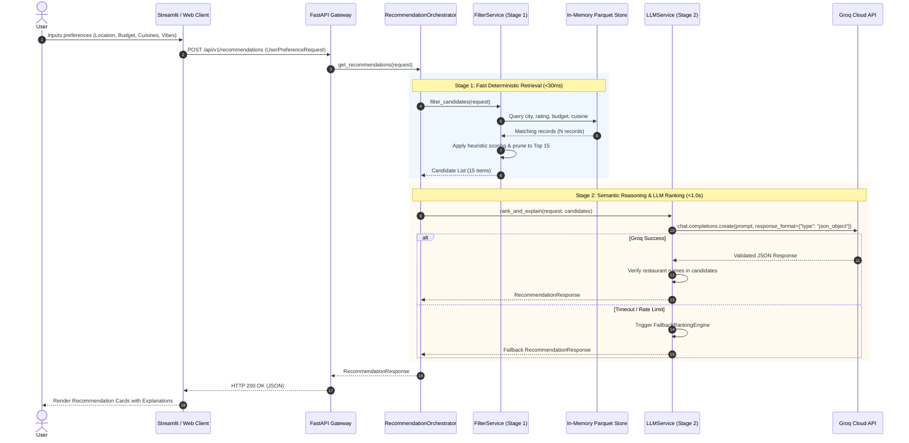
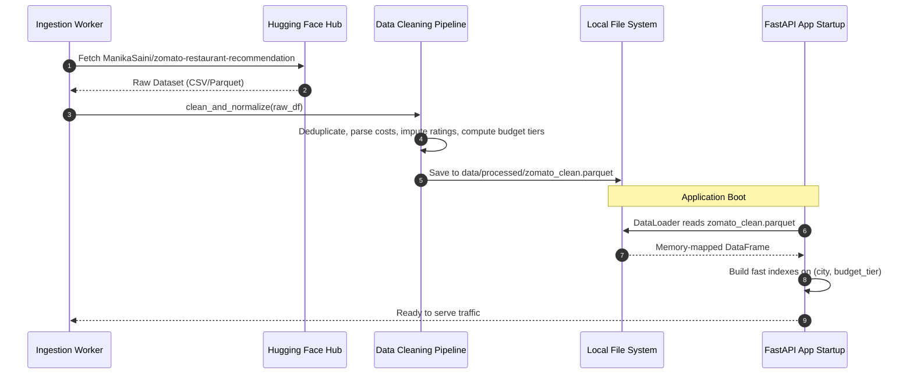

# System Architecture Document: AI-Powered Restaurant Recommendation System
*(Zomato Use Case)*

---

## 1. Architectural Overview & Design Principles

### 1.1 Executive Summary
The **AI-Powered Restaurant Recommendation System** is designed as a high-throughput, low-latency, hybrid recommendation platform. It combines deterministic data retrieval (over structured tabular restaurant records) with generative AI reasoning (via Groq's ultra-low latency LPU Inference Engine using the `groq` Python SDK and `openai/gpt-oss-120b`) to deliver personalized, explainable dining recommendations.

### 1.2 Core Architectural Principles
1. **Separation of Concerns (SoC)**:
   - **Data Tier**: Manages offline data ingestion, sanitization, and in-memory indexing.
   - **Retrieval Tier (Stage 1)**: Performs sub-50ms deterministic filtering, pruning thousands of candidates down to a high-relevance subset.
   - **Reasoning Tier (Stage 2)**: Focuses exclusively on contextual re-ranking, nuance extraction, and human-like explanation generation.
   - **Presentation Tier**: Exposes decoupled RESTful APIs (FastAPI) and an interactive web interface (Streamlit).
2. **Zero-Hallucination Grounding**:
   - The LLM is strictly constrained to rank and describe *only* restaurants supplied within the pre-filtered candidate context. No external or phantom restaurants can be generated.
3. **Graceful Degradation & High Availability**:
   - If the LLM service experiences network failure, rate limiting, or invalid output, the system seamlessly falls back to a deterministic heuristic ranking engine, ensuring zero downtime.
4. **Statelessness & Scalability**:
   - The core recommendation engine is stateless, allowing horizontal scaling across multiple API worker processes (Uvicorn).

---

## 2. End-to-End System Architecture

```
+===================================================================================================+
|                                        PRESENTATION TIER                                          |
|                                                                                                   |
|    +----------------------------------------+       +----------------------------------------+    |
|    |        Streamlit Web Application       |       |       FastAPI Swagger / OpenAPI UI     |    |
|    |    (Sliders, Multi-selects, Cards)     |       |       (Interactive API Explorer)       |    |
|    +----------------------------------------+       +----------------------------------------+    |
+===================================================================================================+
                                                   |
                                                   | HTTP POST /api/v1/recommendations
                                                   v
+===================================================================================================+
|                                     APPLICATION / API TIER                                        |
|                                                                                                   |
|  +---------------------------------------------------------------------------------------------+  |
|  | FastAPI Gateway (`app/main.py`)                                                             |  |
|  |  - CORS & Timing Middleware                                                                  |  |
|  |  - Global Exception Handling & Logging                                                      |  |
|  |  - Pydantic v2 Request Validation (`UserPreferenceRequest`)                                  |  |
|  +---------------------------------------------------------------------------------------------+  |
|                                                  |                                                |
|                                                  v                                                |
|  +---------------------------------------------------------------------------------------------+  |
|  | Recommendation Orchestrator (`app/services/recommendation_service.py`)                      |  |
|  |  - Coordinates Stage 1 Retrieval and Stage 2 Reasoning                                      |  |
|  |  - Enforces execution timeouts and fallback triggers                                        |  |
|  +---------------------------------------------------------------------------------------------+  |
+===================================================================================================+
                          |                                                 |
                          | 1. Query Candidates                             | 2. Prompt & Rank Candidates
                          v                                                 v
+===================================================+   +===========================================+
|               STAGE 1: RETRIEVAL TIER             |   |           STAGE 2: REASONING TIER         |
|                                                   |   |                                           |
|  +---------------------------------------------+  |   |  +-------------------------------------+  |
|  | FilterService (`app/services/filter.py`)     |  |   |  | LLMService (`app/services/llm.py`)  |  |
|  |  - Geo-location normalizer & fuzzy matching  |  |   |  |  - Grounded prompt synthesis        |  |
|  |  - Rating pruning (>= min_rating)            |  |   |  |  - User context injection           |  |
|  |  - Budget-tier classification (Low/Med/High) |  |   |  |  - Candidate JSON serialization     |  |
|  |  - Cuisine intersection matching             |  |   |  +-------------------------------------+  |
|  |  - Heuristic Candidate Scorer                |  |                      |                       |
|  |  - Dynamic query relaxation strategy        |  |                      v                       |
|  +---------------------------------------------+  |   |  +-------------------------------------+  |
|                         |                         |   |  | Groq Python SDK (openai/gpt-oss-120b)|  |
|                         v                         |   |  |  - JSON Mode (json_object)          |  |
|  +---------------------------------------------+  |   |  |  - Humanized explanation generation |  |
|  | In-Memory Data Store (`DataLoader`)          |  |   |  +-------------------------------------+  |
|  |  - Clean Parquet / Arrow columnar table     |  |   |                      |                       |
|  |  - Indexed by City, Budget, Rating           |  |   |                      v                       |
|  +---------------------------------------------+  |   |  +-------------------------------------+  |
+===================================================+   |  | Fallback Heuristic Engine           |  |
                          ^                             |  |  - Active on API error / timeout    |  |
                          | Load at startup             |  +-------------------------------------+  |
+===================================================+   +===========================================+
|             DATA INGESTION & OFFLINE TIER         |
|                                                   |
|  +---------------------------------------------+  |
|  | Ingestion Script (`scripts/ingest_data.py`) |  |
|  |  - Hugging Face Dataset Download            |  |
|  |  - Data Cleansing & Missing Value Handler   |  |
|  |  - Budget Tier Feature Engineering          |  |
|  |  - Parquet Serialization                    |  |
|  +---------------------------------------------+  |
|                         |                         |
|                         v                         |
|    `data/processed/zomato_clean.parquet`          |
+===================================================+
```

---

## 3. Detailed Component Decomposition

### 3.1 Data Ingestion & Storage Pipeline
* **Source**: Hugging Face dataset `ManikaSaini/zomato-restaurant-recommendation`.
* **Preprocessing Component** (`scripts/ingest_data.py`):
  - **Deduplication**: Deduplicate entries based on `(restaurant_name, city, address)`.
  - **Type Normalization**:
    - `average_cost_for_two`: Strip commas, cast to integer. Impute missing values with city-wide median.
    - `aggregate_rating`: Convert string ratings (`"4.1"`, `"NEW"`, `"-"`) to float; invalid values map to `None`.
    - `votes`: Cast to integer; missing defaults to 0.
  - **Feature Engineering**:
    - `budget_tier`:
      $$\text{budget\_tier} = \begin{cases} \text{low}, & \text{cost} \le 500 \\ \text{medium}, & 500 < \text{cost} \le 1500 \\ \text{high}, & \text{cost} > 1500 \end{cases}$$
    - `cuisines_list`: Lowercased and stripped list of cuisines (e.g., `["north indian", "chinese"]`).
    - `highlights_list`: Normalized array of features (e.g., `["outdoor seating", "wifi", "valet parking"]`).
* **Storage Artifact**: `data/processed/zomato_clean.parquet` (compressed columnar format providing instant memory mapping).

---

### 3.2 Stage 1: Retrieval & Deterministic Filtering (`FilterService`)
The retrieval stage reduces $\sim 10,000+$ records to $10\text{--}20$ top-priority candidates within $< 30\text{ms}$.

#### Multi-Stage Funnel:
1. **Location Filtering**:
   - Case-insensitive substring and token match on `city` and `locality`.
2. **Rating Constraint**:
   - Filter `aggregate_rating >= request.min_rating`.
3. **Budget Constraint**:
   - Exact match on `budget_tier == request.budget_tier`.
4. **Cuisine Overlap**:
   - If user specified cuisines: match any record where $\text{cuisines\_list} \cap \text{user\_cuisines} \neq \emptyset$.
5. **Dynamic Relaxation Strategy**:
   - If candidate count $< 5$:
     - *Step 1*: Relax budget tier to adjacent tier (e.g., allow `medium` if `low` requested).
     - *Step 2*: Relax rating threshold by $-0.5$ (floor at $3.0$).
     - *Step 3*: Widen cuisine filter to full city recommendations.
6. **Heuristic Pre-Ranking Formula**:
   $$\text{CandidateScore} = (\text{Rating} \times 0.6) + \left(\log_{10}(\text{Votes} + 1) \times 0.4\right) + \text{CuisineMatchBonus}$$
   The top $K = 15$ candidates are passed to Stage 2.

---

### 3.3 Stage 2: Reasoning & Explanation Engine (`LLMService`)
The reasoning engine utilizes Groq's high-speed LPU inference (via the `groq` SDK and `openai/gpt-oss-120b`) to synthesize user intent and generate human-like recommendations.

#### Responsibilities:
1. **Context Synthesis**: Parses the user's free-text `additional_preferences` (e.g., *"quiet rooftop with romantic lighting for an anniversary"*).
2. **Candidate Evaluation**: Cross-references user intent against the 15 candidate restaurants' cuisines, highlights, ratings, and cost.
3. **Structured Response Generation**:
   - Groq's native JSON mode (`response_format={"type": "json_object"}`) is parsed and validated against the Pydantic schema [`RecommendationResponse`](file:///C:/Users/HP/workspace/AI_AI_AI/ToDo/DemoZomoto/zomoto-plan.md#L185-L190).
   - Generates the top 3–5 ranked restaurants with a custom `explanation` per entry.

#### Grounding & Hallucination Prevention:
- **System Instruction**:
  > *"You are a culinary expert and restaurant recommender. You are strictly forbidden from recommending any restaurant not present in the provided CANDIDATE LIST. Do not invent details."*
- **Integrity Validation**:
  - The application verifies that every `restaurant_name` in the LLM response exists in the candidate subset. Any hallucinated entry is stripped automatically before returning.

---

### 3.4 Fallback Engine (Circuit Breaker)
If the LLM call fails (timeout $> 4\text{s}$, rate limit, or invalid response):
1. The system invokes `FallbackRankingEngine`.
2. Sorts candidates by `CandidateScore` descending.
3. Synthesizes deterministic explanations using metadata:
   - Template: *"Highly rated {cuisine} dining in {locality} with a strong {rating} star rating from {votes} diners, matching your {budget_tier} budget."*
4. Sets response flag: `is_fallback: true` for transparency.

---

## 4. Sequence & Interaction Diagrams

### 4.1 End-to-End Recommendation Flow



---

### 4.2 Data Ingestion & System Startup Flow



---

## 5. Candidate Funnel Model

The architecture implements a rigorous multi-stage candidate pruning funnel:

```
[ Raw Dataset: ~10,000+ Records ]
               |
               | (City / Locality Match)
               v
[ City Subset: ~1,500 - 3,000 Records ]
               |
               | (Min Rating & Budget Tier Filter)
               v
[ Viable Pool: ~100 - 400 Records ]
               |
               | (Cuisine Overlap & Heuristic Ranking Formula)
               v
[ Stage 1 Candidates: Top 15 Records ]
               |
               | (Prompt Context Injection + Groq Reasoning)
               v
[ Final Output: Top 3 - 5 Curated & Explained Recommendations ]
```

---

## 6. API Interface & Data Contract Specification

### 6.1 `POST /api/v1/recommendations`
Generates personalized restaurant recommendations based on user preferences.

#### Request Headers:
`Content-Type: application/json`

#### Request Body (`UserPreferenceRequest`):
```json
{
  "location": "Bangalore",
  "budget_tier": "medium",
  "cuisines": ["Italian", "Pizza"],
  "min_rating": 4.0,
  "additional_preferences": "A cozy place with outdoor seating, great pasta, and romantic ambiance for a couple."
}
```

#### Response Body (`RecommendationResponse`):
```json
{
  "summary": "Here are the top 3 Italian dining spots in Bangalore fitting your romantic date preference with outdoor seating within a medium budget.",
  "is_fallback": false,
  "recommendations": [
    {
      "rank": 1,
      "restaurant_name": "Chianti",
      "cuisine": "Italian, Pizza, Pasta",
      "rating": 4.5,
      "estimated_cost_for_two": 1500.0,
      "explanation": "Chianti in Indiranagar offers an authentic Italian trattoria vibe with complimentary antipasto, candle-lit tables, and exceptional hand-rolled pasta, perfectly matching your romantic date criteria."
    },
    {
      "rank": 2,
      "restaurant_name": "Toscano",
      "cuisine": "Italian, European, Wine",
      "rating": 4.4,
      "estimated_cost_for_two": 1400.0,
      "explanation": "Toscano features charming alfresco terrace seating, extensive wine pairings, and wood-fired artisanal sourdough pizzas."
    },
    {
      "rank": 3,
      "restaurant_name": "Onesta",
      "cuisine": "Pizza, Italian, Desserts",
      "rating": 4.2,
      "estimated_cost_for_two": 800.0,
      "explanation": "A very approachable option with rooftop seating, unlimited pizza crust variations, and great desserts."
    }
  ]
}
```

---

## 7. Performance Budgets & SLA Specifications

| Operation | Target Latency | P95 Latency | Mechanism |
|---|---|---|---|
| **Data Lookup & Pre-filter (Stage 1)** | $\le 15\text{ms}$ | $\le 30\text{ms}$ | In-memory Pandas columnar queries / pre-indexed city subsets. |
| **Heuristic Scoring & Pruning** | $\le 5\text{ms}$ | $\le 10\text{ms}$ | Vectorized NumPy mathematical operations. |
| **LLM Inference & Serialization (Stage 2)** | $\le 800\text{ms}$ | $\le 1500\text{ms}$ | Groq LPU (`openai/gpt-oss-120b`) via `groq` SDK with native JSON mode. |
| **End-to-End API Response** | $\le 900\text{ms}$ | $\le 1600\text{ms}$ | Overall SLA for user interaction. |
| **Fallback Invocation (on timeout)** | $\le 25\text{ms}$ | $\le 40\text{ms}$ | Instant local synthesis when circuit breaker fires at $3.5\text{s}$. |

---

## 8. Security & Environment Configuration

1. **API Key Isolation**:
   - `GROQ_API_KEY` loaded via python-dotenv (`.env`) or container environment variable. Never hardcoded or logged.
2. **Input Sanitization**:
   - Strict Pydantic v2 field validation prevents prompt injection attempts in `additional_preferences` by escaping special characters and bounding length to 300 characters.
3. **CORS Policy**:
   - Configured in FastAPI to only allow requests from authorized frontend origins (e.g. Streamlit on `localhost:8501`).
