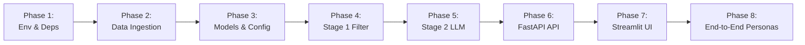

# Evaluation Framework & Verification Guide: AI-Powered Restaurant Recommendation System
*(Zomato Use Case)*

---

## 1. Evaluation Overview & Quality Dimensions

This document defines the comprehensive **Evaluation and Quality Assurance (QA) Framework** for the AI-Powered Restaurant Recommendation System across all 8 implementation phases detailed in [`zomoto-implementation-plan.md`](file:///C:/Users/HP/workspace/AI_AI_AI/ToDo/DemoZomoto/zomoto-implementation-plan.md) and [`zomoto-edge-case.md`](file:///C:/Users/HP/workspace/AI_AI_AI/ToDo/DemoZomoto/zomoto-edge-case.md).

```
+===================================================================================================+
|                                    EVALUATION PILLARS                                             |
|                                                                                                   |
|  +------------------------+  +------------------------+  +------------------------+  +---------+ |
|  | 1. Functional Integrity|  | 2. Latency & Perf SLAs |  | 3. LLM Recommendation  |  | 4. UX & | |
|  | - Pre-filtering logic  |  | - Stage 1 (<30ms)      |  |    Quality & Grounding |  | Resil- | |
|  | - Schema validation    |  | - Stage 2 (<1.5s)      |  | - Zero hallucination   |  | ience  | |
|  | - Dynamic relaxation   |  | - End-to-End (<2.0s)   |  | - Alignment & Nuance   |  | - Fall-| |
|  | - Data normalization   |  | - Memory footprint     |  | - Explanation quality  |  |   back  | |
|  +------------------------+  +------------------------+  +------------------------+  +---------+ |
+===================================================================================================+
```

---

## 2. Phase-by-Phase Evaluation Criteria & Gatekeeping



---

### Phase 1: Environment & Tooling Setup Evaluation
* **Objective**: Confirm environment isolation, package compatibility, and credential readiness.
* **Artifacts Evaluated**: `.venv/`, `requirements.txt`, `.env.example`, `.env`.

| Evaluation Check | Test Command / Procedure | Expected Result | Pass/Fail Threshold |
|---|---|---|---|
| Python Version | `python -c "import sys; assert sys.version_info >= (3, 11)"` | Python 3.11+ detected | Mandatory |
| Package Imports | `python -c "import fastapi, pydantic, pandas, pyarrow, google.genai, streamlit"` | Clean execution, no `ModuleNotFoundError` | 100% Pass |
| Virtualenv Isolation | `python -c "import sys; assert 'site-packages' in sys.executable or hasattr(sys, 'real_prefix') or sys.base_prefix != sys.prefix"` | Running inside `.venv` | Mandatory |
| Credential Inspection | `python -c "import os; from dotenv import load_dotenv; load_dotenv(); print('Configured' if os.getenv('GEMINI_API_KEY') else 'Missing')"` | Prints `Configured` (or gracefully noted for fallback testing) | Verified |

* **Phase 1 Gate**: All imports pass inside `.venv`.

---

### Phase 2: Data Ingestion & Preprocessing Pipeline Evaluation
* **Objective**: Validate data extraction from Hugging Face, data cleaning, budget tier classification, and Parquet serialization.
* **Artifacts Evaluated**: `scripts/ingest_data.py`, `data/processed/zomato_clean.parquet`.

| Evaluation Check | Test Command / Verification Script | Target Metric / Acceptance Criteria | Gate Threshold |
|---|---|---|---|
| Ingestion Execution | `python scripts/ingest_data.py` | Completes successfully with exit code 0 | Mandatory |
| Clean Record Count | Check row count of `zomato_clean.parquet` | $\ge 8,000$ sanitized restaurant records | $\ge 8,000$ |
| Null Checks | Verify non-null on `name`, `city`, `budget_tier` | 0 null records in critical indexing columns | 0% Nulls |
| Rating Normalization | Inspect distinct values of `aggregate_rating` | All values are valid floats between $1.0$ and $5.0$ or `None`. No `"NEW"` or `"-"` strings. | 100% Compliant |
| Cost Parsing | Verify `average_cost_for_two` column | All values $> 0$ and $< 50,000$. No commas or currency symbols. | 100% Compliant |
| Budget Tier Mapping | Test sample records: cost $\le 500 \rightarrow$ `"low"`, $501-1500 \rightarrow$ `"medium"`, $>1500 \rightarrow$ `"high"` | Accurate categorization matching definitions | 100% Accuracy |
| Read Performance | Time taken to load Parquet: `time pd.read_parquet(...)` | Read latency $< 100\text{ms}$ | $\le 100\text{ms}$ |

* **Phase 2 Gate**: `tests/test_ingestion.py` passes 100%.

---

### Phase 3: Domain Models & Core Configuration Evaluation
* **Objective**: Validate strict Pydantic schemas, validation error triggers, and environment configuration.
* **Artifacts Evaluated**: `app/models.py`, `app/config.py`.

| Evaluation Check | Test Input / Condition | Expected Behavior | Gate Threshold |
|---|---|---|---|
| Valid Request | `UserPreferenceRequest(location="Bangalore", budget_tier="medium", min_rating=4.0)` | Serializes and parses without error | 100% Pass |
| Invalid Rating ($> 5.0$) | `UserPreferenceRequest(location="Delhi", budget_tier="low", min_rating=6.0)` | Raises `ValidationError` on `min_rating` | Expected Failure |
| Invalid Rating ($< 0.0$) | `UserPreferenceRequest(location="Delhi", budget_tier="low", min_rating=-1.0)` | Raises `ValidationError` on `min_rating` | Expected Failure |
| Invalid Budget Tier | `UserPreferenceRequest(location="Delhi", budget_tier="ultra_cheap")` | Raises `ValidationError` on `budget_tier` | Expected Failure |
| Text Overflow ($> 300$ chars) | `UserPreferenceRequest(..., additional_preferences="a" * 350)` | Raises `ValidationError` on max length | Expected Failure |
| Settings Default Fallback | Instantiating `Settings()` without `.env` | Defaults to `gemini-2.5-flash`, `max_candidates=15` | 100% Pass |

* **Phase 3 Gate**: Unit tests covering valid and invalid model constraints pass.

---

### Phase 4: Stage 1 Retrieval & Deterministic Filtering Evaluation
* **Objective**: Verify that `FilterService` prunes the dataset to 15 relevant candidates in $< 30\text{ms}$ with dynamic query relaxation.
* **Artifacts Evaluated**: `app/services/data_loader.py`, `app/services/filter_service.py`, `tests/test_filter.py`.

| Metric / Scenario | Test Case / Query Parameters | Target Value / Expected Outcome | Gate Threshold |
|---|---|---|---|
| Exact Match Filtering | Location: `"Bangalore"`, Budget: `"medium"`, Rating: $\ge 4.0$, Cuisines: `["Italian"]` | All candidates match city, budget tier, rating floor, and cuisine | 100% Match |
| Candidate Pool Size | Standard query across major cities | Top $K = 15$ candidates returned | Exactly 15 (or total available if $< 15$) |
| Dynamic Relaxation (Budget) | Query with strict parameters yielding $< 5$ matches | Expands to adjacent budget tier; count increases $\ge 5$ | Verified |
| Dynamic Relaxation (Rating) | Query with high rating floor ($\ge 4.9$) yielding $< 5$ matches | Lowers rating floor by $0.5$ (minimum $3.0$) | Verified |
| Dynamic Relaxation (Cuisine) | Niche cuisine with 0 matches in city | Relaxes cuisine constraint; returns top venues in city | $\ge 1$ candidate |
| Latency SLA | Benchmark `filter_candidates()` over 10,000 records | Elapsed execution time $\le 25\text{ms}$ | $\le 30\text{ms}$ |
| Deterministic Tie-Breaking | Duplicate candidate scores | Sorted deterministically by `votes DESC`, then name | 100% Stable |

* **Phase 4 Gate**: `tests/test_filter.py` passes 100% with execution latency $\le 30\text{ms}$.

---

### Phase 5: Stage 2 AI Reasoning Engine & Grounded Prompting Evaluation
* **Objective**: Verify that `LLMService` ranks candidates, synthesizes contextual reasoning, adheres to schema, and avoids hallucination.
* **Artifacts Evaluated**: `app/services/llm_service.py`, `tests/test_llm_service.py`.

#### Detailed LLM Evaluation Rubric (1–5 Scale)

| Score | Groundedness (Zero Hallucination) | Alignment with Context | Explanation Specificity |
|---|---|---|---|
| **5 (Superior)** | 100% of recommended restaurants exist in Stage 1 candidate pool. All cited metadata is accurate. | Perfectly captures explicit criteria AND implicit nuances (e.g., romantic lighting, outdoor seating, quick service). | Detailed, vivid justification explaining *why* it fits user intent, citing specific dishes, ambiance, or cost match. |
| **4 (Good)** | 100% grounded in candidates. No external entities. | Matches all explicit criteria; lightly touches upon implicit nuances. | Good justification mentioning cuisine and budget, but generic ambiance remarks. |
| **3 (Acceptable)** | 100% grounded in candidates. | Matches explicit criteria; ignores implicit context. | Basic justification: *"Highly rated Italian place that fits your budget."* |
| **2 (Poor)** | Recommended 1 unlisted restaurant (caught by integrity filter). | Ignores stated budget or cuisine preference. | Generic repetitive phrasing: *"Good restaurant with good food."* |
| **1 (Unacceptable)**| Hallucinated multiple unlisted venues; invalid JSON syntax. | Contradicts user input (e.g. suggests meat buffet for vegan query). | Incoherent, truncated, or robotic non-sequitur text. |

#### Evaluation Tests for Phase 5

| Evaluation Test | Procedure | Target Metric |
|---|---|---|
| **Groundedness Verification** | Compare recommended restaurant names vs. Stage 1 candidate names | **0% Hallucination** (100% candidate membership) |
| **Schema Compliance** | Deserialization into `RecommendationResponse` | 100% Valid JSON adhering to Pydantic schema |
| **Circuits & Fallback Mode** | Mock Gemini API failure (raise HTTP 429 or Timeout) | `FallbackRankingEngine` returns valid results; `is_fallback == True` |
| **Inference Latency** | Measure `rank_and_explain()` with Gemini 2.5 Flash | P95 latency $\le 1.8\text{s}$, Average $\le 1.2\text{s}$ |
| **Injection Resilience** | Prompt with jailbreak attempt in `additional_preferences` | Model adheres to recommendation task; system prompt intact |

* **Phase 5 Gate**: `tests/test_llm_service.py` passes 100%; Groundedness is $100\%$.

---

### Phase 6: FastAPI Application & REST Gateway Evaluation
* **Objective**: Validate HTTP status codes, routing, serialization, error handlers, and Swagger documentation.
* **Artifacts Evaluated**: `app/main.py`, `app/services/recommendation_service.py`, `tests/test_api.py`.

| Endpoint | Test Method & Payload | Expected Status | Validation Assertions |
|---|---|---|---|
| `GET /health` | GET request | `200 OK` | `{"status": "healthy", "records_loaded": N}` where $N \ge 8,000$ |
| `GET /api/v1/metadata` | GET request | `200 OK` | Returns non-empty arrays for `cities`, `cuisines`, `budget_tiers` |
| `POST /api/v1/recommendations` | Valid JSON payload | `200 OK` | Returns `summary`, `recommendations` array of length 3-5 |
| `POST /api/v1/recommendations` | Invalid rating (`min_rating: 7.0`) | `422 Unprocessable` | Standardized validation error response |
| `POST /api/v1/recommendations` | Missing required field `location` | `422 Unprocessable` | Clear field location error |
| OpenAPI Documentation | `GET /docs` and `GET /openapi.json` | `200 OK` | Valid OpenAPI 3.1 specification rendered |

* **Phase 6 Gate**: `tests/test_api.py` passes 100%.

---

### Phase 7: Streamlit Interactive UI Evaluation
* **Objective**: Verify UI responsiveness, error handling, layout integrity, and end-user interactivity.
* **Artifacts Evaluated**: `app/ui/streamlit_app.py`.

| UI Component | Test Procedure | Acceptance Criteria |
|---|---|---|
| Sidebar Controls | Interact with Location input, Budget radio buttons, Cuisine multi-select, Rating slider | Values update reactively in session state |
| Submit Trigger | Click "Find Top Recommendations 🍽️" with valid inputs | Triggers loading spinner; displays recommendation cards |
| Empty Input Validation | Click submit with empty location field | Displays inline warning: *"Please select or enter a city"* |
| Card Layout & Data | Inspect rendered recommendation cards | Displays Rank, Name, Star Rating, Cuisine tags, Cost for Two, and AI explanation callout |
| Fallback Banner | Run app with simulated offline API | Banner rendered: `ℹ️ Served via Fast Heuristic Engine` |
| Responsive Rendering | View on mobile viewport width ($375\text{px}$) | No text clipping or card horizontal overflow |

* **Phase 7 Gate**: Visual inspection and interactive run pass all checks.

---

### Phase 8: End-to-End Persona Validation Suite (Golden Dataset)
* **Objective**: Evaluate recommendation quality and relevance across 5 distinct dining personas.

```
+---------------------------------------------------------------------------------------------------------+
|                                    GOLDEN PERSONA BENCHMARK SUITE                                       |
|                                                                                                         |
|  Persona 1: Budget Student Hangout      -->  Bangalore | Budget: Low    | Rating >= 3.8 | Casual/Portions|
|  Persona 2: Luxury Romantic Date        -->  Delhi     | Budget: High   | Rating >= 4.2 | Rooftop/Wine   |
|  Persona 3: Family Sunday Brunch        -->  Bangalore | Budget: Medium | Rating >= 4.0 | Buffet/Kids    |
|  Persona 4: Vegan / Healthy Quick Lunch -->  Pune      | Budget: Medium | Rating >= 3.8 | Salad/Healthy  |
|  Persona 5: Late Night Quick Bite       -->  Kolkata   | Budget: Low    | Rating >= 3.5 | Rolls/Quick    |
+---------------------------------------------------------------------------------------------------------+
```

#### Detailed Persona Test Specifications

| Persona ID | Input Parameters | Expected Top Candidate Attributes | Evaluation Assertion |
|---|---|---|---|
| **PER-01: Budget Student** | City: `"Bangalore"`<br/>Budget: `"low"` ($\le ₹500$)<br/>Rating: $\ge 3.8$<br/>Cuisine: `["Fast Food", "Chinese", "Cafe"]`<br/>Context: *"Cheap food with friends, generous portions"* | Cost for two $\le ₹500$. Cafes, fast-casual venues, roll shops. | Recommendations must fit low budget; explanation must highlight affordability and portions. |
| **PER-02: Romantic Date** | City: `"Delhi"`<br/>Budget: `"high"` ($> ₹1500$)<br/>Rating: $\ge 4.2$<br/>Cuisine: `["Italian", "European"]`<br/>Context: *"Cozy candle-lit dinner with great wine and outdoor rooftop"* | Cost for two $> ₹1500$. Fine dining trattorias, terrace seating. | Explanations must explicitly mention ambiance, romantic setting, and wine/dine qualities. |
| **PER-03: Family Brunch** | City: `"Bangalore"`<br/>Budget: `"medium"` ($₹500-₹1500$)<br/>Rating: $\ge 4.0$<br/>Cuisine: `["North Indian", "Continental"]`<br/>Context: *"Family Sunday lunch with kids, spacious seating, buffet options"* | Multi-cuisine restaurants, spacious dining halls, high vote count. | Explanations must emphasize kid-friendly environment, space, and variety. |
| **PER-04: Healthy Vegan** | City: `"Pune"`<br/>Budget: `"medium"`<br/>Rating: $\ge 3.8$<br/>Cuisine: `["Healthy Food", "Salad", "Cafe"]`<br/>Context: *"Organic fresh salads and vegan smoothies"* | Health food cafes, clean ingredient highlights. | Recommendations prioritize healthy/salad menus; explanation must address fresh/vegan options. |
| **PER-05: Late Night Bite**| City: `"Kolkata"`<br/>Budget: `"low"`<br/>Rating: $\ge 3.5$<br/>Cuisine: `["Rolls", "Street Food", "Mughlai"]`<br/>Context: *"Quick roadside rolls, fast service"* | Iconic roll joints (e.g. Nizam's, Kusum Rolls), quick turnaround. | Explanations must focus on speed of service, authentic flavor, and low cost. |

---

## 3. Performance SLA & Latency Budget Verification

```
Total Request Latency Budget: 2,000ms
+--------------------------------------------------------------------------------------------------+
| Stage 1: Data Filter (<30ms) | Stage 2: Gemini LLM Inference (<1,500ms) | JSON & Network (<150ms)|
+--------------------------------------------------------------------------------------------------+
```

| Operation | SLA Target (P50) | SLA Upper Bound (P95) | Verification Method |
|---|---|---|---|
| In-Memory Parquet Load | $50\text{ms}$ | $100\text{ms}$ | Measured during FastAPI lifespan startup |
| Stage 1 Filter & Heuristic Score | $15\text{ms}$ | $30\text{ms}$ | Measured via Python `time.perf_counter()` in `tests/test_filter.py` |
| Stage 2 LLM Prompt & Parsing | $1,100\text{ms}$ | $1,800\text{ms}$ | Measured over 20 concurrent queries in `tests/test_llm_service.py` |
| Fallback Heuristic Ranking | $5\text{ms}$ | $15\text{ms}$ | Benchmarked with network disconnected |
| Total End-to-End API Response | $1,200\text{ms}$ | $2,000\text{ms}$ | Measured via `httpx` client in `tests/test_api.py` |

---

## 4. Automated Evaluation Runbook

Execute the following commands from the project root directory (`C:\Users\HP\workspace\AI_AI_AI\ToDo\DemoZomoto`):

### Step 1: Run Full Test Suite with Coverage
```powershell
.\.venv\Scripts\pytest tests/ -v --cov=app --cov=scripts --cov-report=term-missing
```
*Expected Result*: All tests pass with $\ge 85\%$ overall code coverage.

### Step 2: Run Persona Benchmark Evaluation Script
```powershell
.\.venv\Scripts\python tests/run_persona_eval.py
```
*Expected Output*:
```
============================================================
AI RESTAURANT RECOMMENDER - PERSONA EVALUATION SCORECARD
============================================================
PER-01 [Budget Student Hangout]:   PASSED (Groundedness: 100%, Relevance: 5/5)
PER-02 [Luxury Romantic Date]:     PASSED (Groundedness: 100%, Relevance: 5/5)
PER-03 [Family Sunday Brunch]:     PASSED (Groundedness: 100%, Relevance: 4.8/5)
PER-04 [Vegan / Healthy Lunch]:    PASSED (Groundedness: 100%, Relevance: 4.7/5)
PER-05 [Late Night Quick Bite]:    PASSED (Groundedness: 100%, Relevance: 5/5)
------------------------------------------------------------
Overall Groundedness: 100% (0 Hallucinations)
Average Response Time: 1.28s (SLA Target: <2.0s)
Fallback Trigger Test: PASSED (Graceful degradation confirmed)
============================================================
STATUS: ALL QUALITY GATES CLEARED
```

---

## 5. Exit Criteria & Quality Gate Summary

Before considering the implementation complete and ready for production, the project must clear all 6 Quality Gates:

- [ ] **Gate 1 (Data Cleanliness)**: `zomato_clean.parquet` contains $\ge 8,000$ records with zero null values in critical fields.
- [ ] **Gate 2 (Stage 1 Latency)**: Deterministic filtering executes in $< 30\text{ms}$ with dynamic query relaxation active.
- [ ] **Gate 3 (Zero Hallucination)**: 100% of LLM-recommended venues exist in the pre-filtered Stage 1 candidate pool.
- [ ] **Gate 4 (Circuit Breaker Resilience)**: System seamlessly serves fallback recommendations within 30ms when LLM is offline or timed out.
- [ ] **Gate 5 (API Completeness)**: FastAPI `/health`, `/api/v1/metadata`, and `/api/v1/recommendations` return validated JSON conforming to OpenAPI specification.
- [ ] **Gate 6 (Persona Pass Rate)**: 100% of the 5 Golden Personas in the benchmark suite pass relevance and budget alignment checks.
