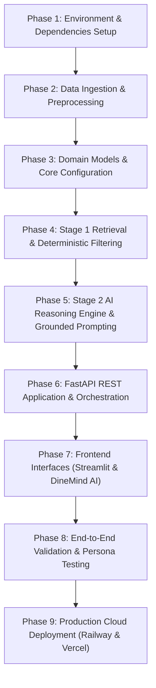

# Implementation Plan: AI-Powered Restaurant Recommendation System
*(Zomato Use Case)*

---

## 1. Plan Overview & Objectives

This implementation plan provides a phased, step-by-step technical blueprint for engineering the **AI-Powered Restaurant Recommendation System**. It translates the architectural requirements in [`zomoto-plan.md`](file:///C:/Users/HP/workspace/AI_AI_AI/ToDo/DemoZomoto/zomoto-plan.md) and [`zomoto-architecture.md`](file:///C:/Users/HP/workspace/AI_AI_AI/ToDo/DemoZomoto/zomoto-architecture.md) into concrete coding tasks, file specifications, dependencies, testing protocols, and execution commands.

---

## 2. Directory Structure & File Map

```
DemoZomoto/
│
├── .venv/                              # Python virtual environment
├── .env.example                        # Environment variables template
├── .gitignore                          # Standard Python gitignore
├── requirements.txt                    # Project dependencies
├── Dockerfile                          # Railway production container build specification
├── railway.json                        # Railway deploy orchestration & healthcheck config
├── Procfile                            # PaaS process runner fallback
├── vercel.json                         # Vercel Edge reverse-proxy & CDN configuration
├── .dockerignore                       # Docker build context exclusion rules
├── .env.production.example             # Template for production cloud environment variables
├── README.md                           # Quickstart guide
├── problemStatement.txt                # Original requirements
├── zomoto-plan.md                      # Project master blueprint
├── zomoto-architecture.md              # System architecture & sequence diagrams
├── zomoto-implementation-plan.md       # Step-by-step task breakdown (this document)
├── deployment-plan.md                  # Railway & Vercel cloud deployment blueprint
│
├── data/
│   ├── raw/                            # Staged raw CSVs from Hugging Face
│   └── processed/
│       └── zomato_clean.parquet        # High-speed preprocessed dataset (2.46 MB)
│
├── scripts/
│   └── ingest_data.py                  # Dataset fetch, cleaning & feature pipeline
│
├── app/
│   ├── __init__.py
│   ├── config.py                       # Pydantic settings & environment configuration
│   ├── models.py                       # Domain models & Pydantic request/response schemas
│   ├── main.py                         # FastAPI application entrypoint & routing
│   │
│   ├── services/
│   │   ├── __init__.py
│   │   ├── data_loader.py              # In-memory Parquet data loading & indexing
│   │   ├── filter_service.py           # Stage 1 deterministic filtering & scoring
│   │   ├── llm_service.py              # Stage 2 Groq prompt engineering & reasoning
│   │   └── recommendation_service.py   # Orchestrator linking Stage 1, Stage 2 & Fallback
│   │
│   ├── static/
│   │   └── index.html                  # DineMind AI Google Stitch frontend (Vercel CDN target)
│   │
│   └── ui/
│       ├── __init__.py
│       └── streamlit_app.py            # Streamlit interactive discovery frontend
│
└── tests/
    ├── __init__.py
    ├── conftest.py                     # Pytest fixtures and mock dataset
    ├── test_ingestion.py               # Data pipeline sanitization tests
    ├── test_filter.py                  # Stage 1 filtering & relaxation unit tests
    ├── test_llm_service.py             # Stage 2 LLM prompt & fallback tests
    └── test_api.py                     # FastAPI REST endpoint integration tests
```

---

## 3. Phased Implementation Roadmap



---

## 4. Detailed Implementation Tasks

### Phase 1: Environment & Dependencies Setup
* **Goal**: Establish an isolated Python environment and define all necessary libraries.
* **Tasks**:
  1. **Task 1.1**: Initialize `.venv` using Python 3.11+:
     ```powershell
     python -m venv .venv
     ```
  2. **Task 1.2**: Create [`requirements.txt`](file:///C:/Users/HP/workspace/AI_AI_AI/ToDo/DemoZomoto/requirements.txt) with pinned dependencies:
     ```txt
     fastapi>=0.115.0
     uvicorn[standard]>=0.32.0
     pydantic>=2.10.0
     pydantic-settings>=2.6.0
     pandas>=2.2.0
     pyarrow>=18.0.0
     datasets>=3.1.0
     groq>=0.18.0
     streamlit>=1.40.0
     python-dotenv>=1.0.1
     httpx>=0.28.0
     pytest>=8.3.0
     pytest-asyncio>=0.24.0
     ```
  3. **Task 1.3**: Install dependencies using explicit virtualenv pip:
     ```powershell
     .\.venv\Scripts\pip install -r requirements.txt
     ```
  4. **Task 1.4**: Create `.env.example` and `.gitignore`:
     ```ini
     # .env.example
     GROQ_API_KEY=your_groq_api_key_here
     ENVIRONMENT=development
     DATA_PATH=data/processed/zomato_clean.parquet
     DEFAULT_LLM_MODEL=openai/gpt-oss-120b
     ```

---

### Phase 2: Data Ingestion & Preprocessing Pipeline
* **Goal**: Download, clean, and convert the Hugging Face dataset into a fast-loading Parquet file.
* **Target File**: `scripts/ingest_data.py`
* **Dataset**: [`ManikaSaini/zomato-restaurant-recommendation`](https://huggingface.co/datasets/ManikaSaini/zomato-restaurant-recommendation)
* **Tasks**:
  1. **Task 2.1**: Implement `scripts/ingest_data.py`:
     - Load dataset via `datasets.load_dataset("ManikaSaini/zomato-restaurant-recommendation")` or fallback to direct CSV download.
     - Handle missing values:
       - Drop records with missing `restaurant_name` or `city`.
       - Impute missing/invalid `average_cost_for_two` with locality or city median.
       - Clean `aggregate_rating` (convert `"NEW"`, `"-"`, `"nan"` to `None`).
     - Feature Engineering:
       - Split comma-separated `cuisines` into clean lowercase lists (`["north indian", "chinese"]`).
       - Compute `budget_tier`:
         - $\le 500 \rightarrow$ `"low"`
         - $501 - 1500 \rightarrow$ `"medium"`
         - $> 1500 \rightarrow$ `"high"`
       - Normalize `city` names (e.g., lowercase, strip whitespace, handle aliases).
     - Save sanitized DataFrame to `data/processed/zomato_clean.parquet` with snappy compression.
  2. **Task 2.2**: Write unit tests in `tests/test_ingestion.py` to verify budget tier assignment and cost cleaning.

---

### Phase 3: Domain Models & Core Configuration
* **Goal**: Implement typed data structures and configuration management.
* **Target Files**: `app/models.py`, `app/config.py`
* **Tasks**:
  1. **Task 3.1**: Create `app/config.py`:
     ```python
     from pydantic_settings import BaseSettings

     class Settings(BaseSettings):
         groq_api_key: str = ""
         environment: str = "development"
         data_path: str = "data/processed/zomato_clean.parquet"
         default_llm_model: str = "openai/gpt-oss-120b"
         max_candidates_stage_1: int = 15
         request_timeout_seconds: float = 4.0

         class Config:
             env_file = ".env"
             extra = "ignore"

     settings = Settings()
     ```
  2. **Task 3.2**: Create `app/models.py`:
     - Define `Restaurant` (internal entity).
     - Define `UserPreferenceRequest` with validators (rating $0.0 - 5.0$, budget tier in `["low", "medium", "high"]`).
     - Define `RestaurantRecommendation` (individual ranked recommendation).
     - Define `RecommendationResponse` (full response including summary and fallback flag).

---

### Phase 4: Stage 1 Retrieval & Deterministic Filtering
* **Goal**: High-speed in-memory filtering that selects the top 15 candidate matches in $< 30\text{ms}$.
* **Target Files**: `app/services/data_loader.py`, `app/services/filter_service.py`
* **Tasks**:
  1. **Task 4.1**: Implement `app/services/data_loader.py`:
     - Load `data/processed/zomato_clean.parquet` once on startup into a Pandas DataFrame.
     - Pre-compute index lookups for fast retrieval by city and budget tier.
     - Provide singleton accessor `get_data_loader()`.
  2. **Task 4.2**: Implement `app/services/filter_service.py`:
     - Method `filter_candidates(request: UserPreferenceRequest) -> List[Restaurant]`:
       1. Filter by `city` (case-insensitive substring match).
       2. Filter by `aggregate_rating >= request.min_rating`.
       3. Filter by `budget_tier == request.budget_tier`.
       4. Filter by cuisine overlap (if specified).
       5. **Dynamic Relaxation**:
          - If matches $< 5$, relax budget tier to adjacent tier.
          - If still $< 5$, lower rating floor by $0.5$ (minimum $3.0$).
          - If still $< 5$, allow all cuisines in the selected city.
       6. Calculate candidate scoring formula:
          $$\text{Score} = (\text{Rating} \times 0.6) + \left(\log_{10}(\text{Votes} + 1) \times 0.4\right) + \text{CuisineBonus}$$
       7. Sort descending and return top `max_candidates_stage_1` (15 items).
  3. **Task 4.3**: Implement unit tests in `tests/test_filter.py`:
     - Verify exact match filtering.
     - Verify dynamic relaxation when 0 matches exist.
     - Verify performance threshold ($\le 30\text{ms}$).

---

### Phase 5: Stage 2 AI Reasoning Engine & Grounded Prompting
* **Goal**: Prompt Groq (openai/gpt-oss-120b) to evaluate candidates against user intent, rank them, and generate contextual explanations with zero hallucination.
* **Target File**: `app/services/llm_service.py`
* **Tasks**:
  1. **Task 5.1**: Implement `LLMService`:
     - Initialize `groq` client (AsyncGroq / Groq) using `settings.groq_api_key`.
     - Construct grounded prompt:
       - System instruction: Senior culinary advisor and local guide. Strict prohibition against inventing unlisted restaurants.
       - Context: User explicit preferences + free-text nuances + JSON string of the 15 candidate restaurants.
       - Enforce structured output via Groq JSON mode (`response_format={"type": "json_object"}`) and Pydantic validation.
  2. **Task 5.2**: Implement `FallbackRankingEngine`:
     - Automatically called if Groq API times out ($> 3.5\text{s}$), hits quota, or fails to parse.
     - Sorts candidates by heuristic score and produces templated, metadata-driven explanations.
     - Sets `is_fallback=True`.
  3. **Task 5.3**: Integrity Verifier:
     - Cross-references recommended restaurant names against candidate names. Drops any ungrounded items.
  4. **Task 5.4**: Write unit & mock tests in `tests/test_llm_service.py`.

---

### Phase 6: FastAPI Application & REST Gateway
* **Goal**: Build and test the production-ready REST API.
* **Target Files**: `app/services/recommendation_service.py`, `app/main.py`
* **Tasks**:
  1. **Task 6.1**: Implement `RecommendationOrchestrator`:
     - Ties `FilterService` (Stage 1) and `LLMService` (Stage 2) together.
     - Measures elapsed execution time.
  2. **Task 6.2**: Implement `app/main.py`:
     - FastAPI app with lifespan handler (loads dataset on startup).
     - CORS middleware for Streamlit communication.
     - Endpoints:
       - `GET /health`: Health check and dataset record count.
       - `GET /api/v1/metadata`: Returns available cities, cuisine list, and budget tiers for UI dropdowns.
       - `POST /api/v1/recommendations`: Core recommendation endpoint.
     - Exception handlers returning standardized JSON errors.
  3. **Task 6.3**: Write API integration tests in `tests/test_api.py` using `httpx.AsyncClient`.

---

### Phase 7: Streamlit Interactive UI
* **Goal**: Build a modern, reactive user interface for food discovery.
* **Target File**: `app/ui/streamlit_app.py`
* **Tasks**:
  1. **Task 7.1**: Sidebar Preference Controls:
     - Location input with autocomplete/dropdown of available cities.
     - Budget Tier selection (segmented buttons or radio: Low $\le ₹500$, Medium $₹500-₹1500$, High $> ₹1500$).
     - Multi-select for popular cuisines (North Indian, Italian, Chinese, Continental, etc.).
     - Slider for Minimum Rating ($3.0$ to $4.8$, step $0.1$).
  2. **Task 7.2**: Main Panel Contextual Input:
     - Text area for free-form preferences: *"e.g., romantic candle-lit dinner with quiet music", "quick business lunch with great parking"*.
     - Action button: `Find Top Recommendations 🍽️`.
  3. **Task 7.3**: Recommendation Cards Display:
     - Summary callout banner explaining the selection logic.
     - Visual cards for each recommended restaurant:
       - Rank badge & Restaurant Name.
       - Rating badge with star icon.
       - Cuisine tags & Estimated Cost for Two.
       - **AI Explanation Section**: Callout box with humanized justification.
       - Fallback indicator if served via heuristic fallback mode.

---

### Phase 8: End-to-End Validation & Persona Testing
* **Goal**: Verify recommendation quality across realistic dining personas.
* **Test Scenarios**:
  1. **Persona A (Budget Student Hangout)**:
     - Location: Bangalore | Budget: Low | Rating: $\ge 3.8$ | Context: *"Cheap eats with friends, large portions, casual seating"*.
  2. **Persona B (Romantic Anniversary Date)**:
     - Location: Delhi | Budget: High | Rating: $\ge 4.2$ | Context: *"Cozy candle-lit rooftop, great wine selection, quiet ambience"*.
  3. **Persona C (Family Sunday Brunch)**:
     - Location: Bangalore | Budget: Medium | Rating: $\ge 4.0$ | Context: *"Spacious, kid-friendly, buffet with live counter"*.
  4. **Persona D (Late Night Quick Bite)**:
     - Location: Mumbai/Delhi | Budget: Low | Rating: $\ge 3.5$ | Context: *"Quick service, rolls or burgers, open late"*.

---

### Phase 9: Production Cloud Deployment (Railway & Vercel)
* **Goal**: Deploy the decoupled full-stack architecture to production cloud infrastructure.
* **Blueprint**: [`deployment-plan.md`](file:///C:/Users/HP/workspace/AI_AI_AI/ToDo/DemoZomoto/deployment-plan.md)
* **Target Files**: `Dockerfile`, `railway.json`, `Procfile`, `vercel.json`, `.dockerignore`, `.env.production.example`
* **Tasks**:
  1. **Task 9.1: Railway Backend Containerization**:
     - Implement `Dockerfile` with Python 3.11-slim, non-root user, and dynamic `$PORT` binding.
     - Configure `railway.json` for automated healthcheck probing on `/health`.
     - Bundle `data/processed/zomato_clean.parquet` (2.46 MB) to ensure instant cold starts.
  2. **Task 9.2: Vercel Global Edge CDN & Zero-CORS Proxy**:
     - Configure `vercel.json` with Edge rewrites routing `/api/*` and `/health` directly to Railway.
     - Serve DineMind AI Google Stitch UI (`app/static/index.html`) at root domain with Edge caching.
  3. **Task 9.3: Automated CI/CD & Persona Cloud Validation**:
     - Verify all 4 dining personas (A–D) against production cloud URLs.

---

## 5. Execution Runbook

### Step 1: Virtual Environment Setup & Installation
```powershell
# In project root: C:\Users\HP\workspace\AI_AI_AI\ToDo\DemoZomoto
python -m venv .venv
.\.venv\Scripts\pip install -r requirements.txt
```

### Step 2: Configure Environment Variables
```powershell
Copy-Item .env.example .env
# Set your GROQ_API_KEY in .env
```

### Step 3: Run Ingestion Script
```powershell
.\.venv\Scripts\python scripts/ingest_data.py
# Verify data/processed/zomato_clean.parquet is created
```

### Step 4: Run Test Suite
```powershell
.\.venv\Scripts\pytest tests/ -v
```

### Step 5: Launch FastAPI Server
```powershell
.\.venv\Scripts\uvicorn app.main:app --host 127.0.0.1 --port 8000 --reload
# Interactive Swagger docs available at http://127.0.0.1:8000/docs
# DineMind AI frontend served at http://127.0.0.1:8000/
```

### Step 6: Launch Streamlit Web UI
```powershell
.\.venv\Scripts\streamlit run app/ui/streamlit_app.py --server.port 8501
# Open browser at http://localhost:8501
```

### Step 7: Deploy Backend to Railway
```powershell
git init
git add .
git commit -m "feat: production cloud deployment for Railway and Vercel"
git branch -M main
git remote add origin https://github.com/<your-username>/DemoZomoto.git
git push -u origin main
# In Railway: New Project -> Deploy from GitHub repo -> Set GROQ_API_KEY & Generate Domain
```

### Step 8: Deploy Frontend to Vercel
```powershell
# Update vercel.json destination with Railway domain
git add vercel.json
git commit -m "chore: link vercel edge proxy to railway backend"
git push
# In Vercel: Import DemoZomoto -> Deploy
```

---

## 6. Definition of Done (DoD) Checklist

- [x] `.venv` active with all pinned requirements installed.
- [x] `scripts/ingest_data.py` executes cleanly and outputs sanitized Parquet data (`2.46 MB`).
- [x] `FilterService` executes Stage 1 pre-filtering in $< 30\text{ms}$.
- [x] `LLMService` correctly produces valid JSON adhering to `RecommendationResponse`.
- [x] Fallback ranking triggers seamlessly if LLM key is absent or API is offline.
- [x] FastAPI Swagger UI shows functional `/health`, `/api/v1/metadata`, and `/api/v1/recommendations`.
- [x] Streamlit & DineMind AI Web interfaces render responsive, visually appealing recommendation cards.
- [x] Full `pytest` test suite passes (94 tests passing across unit, API, and persona evaluations).
- [x] `Dockerfile`, `railway.json`, and `Procfile` configured for containerized Railway deployment.
- [x] `vercel.json` configured with Edge rewrites for Zero-CORS routing to Railway.
- [x] Cloud deployment runbook documented in [`deployment-plan.md`](file:///C:/Users/HP/workspace/AI_AI_AI/ToDo/DemoZomoto/deployment-plan.md).
